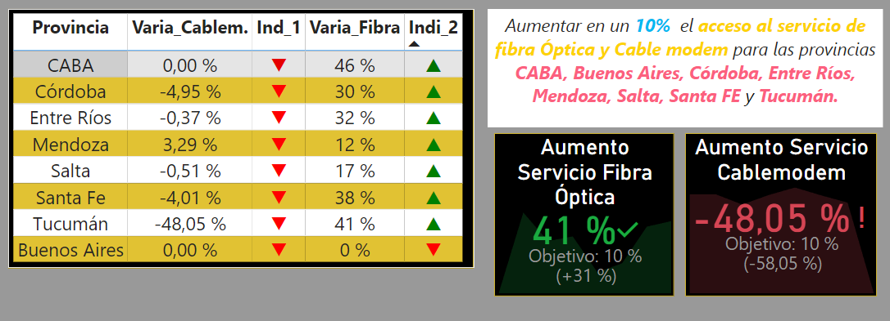

# Comprensión del negocio

La compañía proveedora de servicios de telecomunicaciones ha solicitado la ejecución de un análisis exhaustivo con el objetivo de comprender el comportamiento del sector a nivel nacional. Este análisis se centra en la actividad principal de la empresa, que es proporcionar acceso a internet. La finalidad es orientar a la compañía para garantizar la calidad de sus servicios, identificar posibles oportunidades de crecimiento y desarrollar soluciones personalizadas para sus potenciales clientes.

## Contexto

Las telecomunicaciones se refieren a la transmisión de información a través de medios electrónicos, como la telefonía, la televisión, la radio y, más recientemente, el internet. Estos medios de comunicación permiten la transmisión de información entre personas, organizaciones y dispositivos a largas distancias.

El internet, por su parte, es una red global de computadoras interconectadas que permite el intercambio de información en tiempo real. Desde su creación, ha tenido un impacto significativo en la vida de las personas, transformando la manera en que nos comunicamos, trabajamos, aprendemos y nos entretenemos.

La industria de las telecomunicaciones ha jugado un papel vital en nuestra sociedad, facilitando la información a escala internacional y permitiendo la comunicación continua incluso en medio de una pandemia mundial. La transferencia de datos y comunicación se realiza en su mayoría a través de internet, líneas telefónicas fijas, telefonía móvil, y en casi cualquier lugar del mundo.

En comparación con la media mundial, Argentina está a la vanguardia en el desarrollo de las telecomunicaciones, teniendo para el 2020 un total de 62,12 millones de conexiones.

## Datos
Para este proyecto se trabajó con los datos del Ente Nacional de Comunicaciones ENACOM [link](https://datosabiertos.enacom.gob.ar/dashboards/20000/acceso-a-internet/)
De los datos presdentes en la pagina de ENACOM se trabajaron con los siguientes :

-   Acceso a Internet fijo por tecnología y provincia [link](https://datosabiertos.enacom.gob.ar/dataviews/240898/acceso-a-internet-fijo-por-tecnologia-y-provincia/)

-   Accesos a Internet fijo por tecnología y localidad [link](https://datosabiertos.enacom.gob.ar/dataviews/252830/accesos-a-internet-fijo-por-tecnologia-y-localidad/)

-   Listado de localidades con conectividad a internet [link](https://datosabiertos.enacom.gob.ar/dataviews/251962/listado-de-localidades-con-conectividad-a-internet/)

-   Penetración de Internet fijo (accesos por cada 100 hogares)[link](https://datosabiertos.enacom.gob.ar/visualizations/32226/penetracion-de-internet-fijo-accesos-por-cada-100-hogares/)

-   Resultados provisionales del CENSO 2022[link](https://censo.gob.ar/index.php/datos_provisionales/)
   

## Ámbito de Proyecto

* El proyecto se desarrolló siguiendo estos aspectos clave:

- Preprocesamiento de datos : [ETL](https://github.com/stevenyb56/PI_DA/blob/main/Notebooks/ETL.ipynb)
- Análisis exploratorio de datos y :[EDA](https://github.com/stevenyb56/PI_DA/blob/main/Notebooks/EDA.ipynb)
- KPI´s :[kpi](https://github.com/stevenyb56/PI_DA/blob/main/Notebooks/KPI.ipynb)

* Adicionales :
- Censo 2022 :[Censo](https://github.com/stevenyb56/PI_DA/blob/main/Notebooks/censo.ipynb)

## ETL

En el proceso de transformación y depuración de datos (ETL), se han implementado una serie de procedimientos cruciales con el objetivo de asegurar la calidad y consistencia de los datos. Estas operaciones tienen como finalidad preparar de manera eficiente el conjunto de datos para su análisis posterior.

--> Proceso de Detección y Tratamiento de Datos Repetidos, y Validación de Tipos de Datos en Cada Tabla: Con el propósito de garantizar la singularidad de las filas en el conjunto de datos, se han eliminado duplicados y se ha llevado a cabo una verificación de los tipos de datos específicos para cada tabla.

--> Criterios de Filtrado de Datos: Se ha aplicado un criterio de filtrado riguroso en la columna 'Provincia' con el fin de identificar y examinar las provincias que poseen la mayor población según el censo de 2022.

--> Integración de Tablas: Como parte del proceso de transformación, se ha llevado a cabo la unificación de las tablas mediante unión (INNER) para obtener información completa y facilitar un procesamiento más eficiente.

--> Manejo de Valores Nulos: Dado que la presencia de valores nulos podría impactar negativamente en el análisis de datos, se han eliminado de forma deliberada. Esto garantiza que solo se consideren registros válidos, previniendo posibles resultados incorrectos en el procesamiento de datos.

--> Eliminación de Registros Inconsistentes: La exclusión de registros incoherentes se presenta como una medida esencial para preservar la calidad de los datos. En casos donde se detectan registros con valores nulos en todas las columnas relevantes, se han eliminado sistemáticamente. Este procedimiento asegura que los análisis futuros se fundamenten en datos fiables y coherentes.

## EDA

Empleando la información derivada del proceso ETL, se realizó un Análisis Exploratorio de Datos (EDA) que reveló información significativa y perspectivas subyacentes, las cuales fueron examinadas mediante Visualizaciones Unidimensionales.

## Analisis exploratorio 

Se llevó a cabo un estudio de análisis de datos para encontrar patrones comprensibles de desempeño de las telecomunicaciones a nivel nacional en Argentina, con un enfoque particular en los servicios de Internet. El objetivo principal es identificar tendencias que permitan generar información crítica para la toma de decisiones relacionadas con el crecimiento, la mejora de la calidad de los servicios y la formulación de decisiones estratégicas.

Se encontraron columnas las cuales se enfatisaban en un Tipo de Técnologia para conectarse a internet, estas tecnologias se describen a continuacion.
        
--> **ADSL =** También conocida como Asymmetric Digital Subscriber Line o Línea de Abonado Digital Asimétrica, es una tecnología de módem que convierte una línea telefónica o un par de cobre de suscriptor en una línea fija de alta velocidad. La tecnología funciona controlando tres canales: dos canales de alta velocidad, uno para recepción de datos, otro para transmisión de datos y un tercer canal para comunicaciones de voz estándar que brindan servicios telefónicos básicos.

--> **Cablemódem =**  Es un varienate de módem que facilita la utilización del ancho de banda que no es utilizado en la transmisión de televisión por cable, destinándolo a la conexión de Internet. Tanto los cables coaxiales como la infraestructura HFC (Hybrid Fiber Coaxial) tienen la capacidad de transmitir considerables volúmenes de datos en ambas direcciones.

--> **Dial Up =** Emplea un módem en conjunto con una línea telefónica. El módem se enlaza al ordenador, facilitando la transmisión y recepción de datos a través de la línea telefónica. Al iniciar la conexión, el módem inicia una llamada telefónica al proveedor de servicios de Internet (ISP), estableciendo así una conexión estable. Es importante tener en cuenta que la velocidad de conexión de dial-up es bastante lenta, lo que implica limitaciones en la capacidad de carga y descarga de datos.

--> **Fibra Óptica =** Es una tecnología avanzada que posibilita la transmisión de datos mediante luz. Está compuesta por cables que contienen hebras de vidrio, las cuales transmiten información, como señales de teléfono, televisión e Internet, a través de pulsos de luz infrarroja. Las fibras ópticas guían pulsos de láser o luz LED por la línea, transmitiendo información de manera "binaria", similar al sistema de 0 y 1 utilizado en electrónica. Una de las ventajas notables es su rápida capacidad de transferencia de datos.

--> **Wimax =** Es una tecnología de comunicaciones de red inalámbrica de próxima generación. La tecnología es similar a Wi-Fi, pero proporciona acceso de banda ancha de alta velocidad en un área más grande con menos interferencia.

--> **Wireless =** WiFi o wireless es Wire (cable) Less (sin) es una tecnología que implica la transmisión de datos entre dispositivos sin la necesidad de conexiones físicas. Utiliza el Protocolo 802.11 y opera en el aire como medio de transmisión, específicamente en una frecuencia de emisión de 2,4 GHz. Algunas variantes del Protocolo 802.11 también pueden emplear el rango de frecuencias de 5,4 GHz. Estas frecuencias libres, aunque eficientes, tienen limitaciones ya que no pueden penetrar paredes u obstáculos

Se destaca que Buenos Aires lidera la demanda de servicios de Internet basados en Fibra Óptica; sin embargo, es notable que la disponibilidad de este servicio en sus localidades es relativamente baja. De las 808 localidades en Buenos Aires, aproximadamente el 42.8%, es decir, 346 localidades, carecen de conexión a Fibra Óptica.

Interesantemente, la provincia de Tucumán experimenta la mayor carencia de Fibra Óptica, con más del 70% de sus localidades sin acceso. Le siguen Entre Ríos, con una situación similar, y las provincias de Córdoba y Santa Fe, donde la falta de este servicio supera el 60%. Mendoza, aunque con una carencia del 56%, sigue en la misma tendencia. En contraste, Salta muestra un 28%, que, aunque menor, sigue siendo un porcentaje significativo dado que cuenta con 120 localidades, de las cuales 34 aún no tienen conexión a Fibra Óptica. Este análisis subraya la necesidad de mejorar la infraestructura de conectividad, especialmente en regiones con porcentajes elevados de falta de servicios de Fibra Óptica.

También se evidenció una marcada variabilidad en el acceso a la fibra óptica entre las distintas provincias. Algunas regiones presentan un acceso más elevado, mientras que otras muestran una cobertura más limitada, especialmente en áreas rurales donde la infraestructura de fibra óptica puede ser más escasa en comparación con las zonas urbanas. Las provincias con un acceso relativamente reducido podrían identificarse como posibles puntos de enfoque para mejoras en la infraestructura de fibra óptica, y estas disparidades podrían estar vinculadas a prioridades en desarrollo económico y tecnológico.

El acceso a servicios de fibra óptica desempeña un papel crucial en la calidad de vida de los habitantes de una provincia en la era digital. La conectividad rápida y confiable es fundamental para diversas actividades, incluyendo educación, trabajo remoto y entretenimiento. Además, estas disparidades en el acceso a la fibra óptica pueden ofrecer información valiosa sobre oportunidades de inversión. Aquellas provincias con una menor cobertura pueden representar oportunidades estratégicas para la expansión de servicios y desarrollo tecnológico.

## KPI´s

En función de lo analizado en el punto anterior, se plantearon 2 objetivos en relación a aumentar el acceso a internet para el proximo trimestre, desde los cuales se proponen dos indicadores de rendimiento clave o KPI.

- ***Aumentar en un ***2% el acceso al servicio de internet*** para el próximo trimestre, cada 100 hogares***

El crecimiento de usuarios en el servicio de internet se evalúa a través de la información sobre la cantidad de suscriptores que poseen el servicio en un periodo específico, restando el número de nuevos suscriptores en otro periodo. Esta metodología proporciona un equilibrio que refleja la adquisición neta del servicio de internet durante ese tiempo. 

Las mediciones mencionadas anteriormente permiten analizar la evolución de los servicios de Internet, teniendo en cuenta tanto el número de nuevos suscriptores como el de personas que abandonan el servicio. Este enfoque proporciona una imagen completa de la dinámica de crecimiento neto, centrándose no sólo en la incorporación de nuevos clientes, sino también en retener a los usuarios existentes. Además, calcular la diferencia entre sus suscriptores en dos momentos diferentes puede brindarle una imagen más precisa de cómo cambia su base de clientes con el tiempo. Este enfoque puede resultar útil para identificar tendencias a largo plazo, evaluar la eficacia de las estrategias de retención de clientes y ajustar las estrategias de marketing según las necesidades del mercado, para ello se establece la siguiente fórmula:

$\text{KPI} = \frac{\text{Nuevo acceso - Acceso actual}}{\text{Acceso actual}}·100$

'Nuevo acceso' hace referencia a la cantidad de hogares que obtendrán acceso a Internet en el trimestre siguiente, mientras que 'Acceso actual' se refiere a la cantidad de hogares que actualmente tienen acceso a Internet durante el trimestre en curso. 

- ***Aumentar un 10 % el acceso al servico de Fibra Óptica y Cablemodem en las provincias de CABA, Buenos Aires, Córdoba, Entre Ríos, Mendoza, Salta, Santa Fe y Tucumán para el proximo semestre***

Como se evidenció en el análisis exploratorio, la ausencia de conexión a internet mediante Fibra Óptica en las provincias de CABA, Buenos Aires, Córdoba, Entre Ríos, Mendoza, Salta, Santa Fe y Tucumán señalan una brecha en la disponibilidad de este servicio. Proponer un aumento del 10 % en el acceso a Fibra Óptica y Cablemódem en estas provincias podría contribuir significativamente a cerrar esa brecha y mejorar la conectividad en estas regiones, ya sea captando a nuevos usuarios o actualizando los usuarios que poseen conexion por cablemodem. Esta medida no solo impulsaría el acceso a tecnologías de conexión más avanzadas, sino que también podría tener impactos positivos en áreas como la educación, el trabajo remoto y el entretenimiento, promoviendo así un desarrollo más equitativo y sostenible en estas localidades. La formula para se establece de la siguiente manera 

$\text{KPI} = \frac{\text{Nuevos usuarios - usuarios actuales}}{\text{usuarios actuales}}·100$

En la siguientes imagenes se aprecian los rendimientos de los dos KPI propuestos.

## Conclusiones y recomendaciones

En el cuarto trimestre del año 2022, se evidencia un aumento en el acceso a los servicios de Internet en comparación con el trimestre anterior. Sin embargo, es importante destacar que este avance no fue uniforme, ya que dos provincias no lograron alcanzar la meta establecida. Esta situación podría deberse a la falta de cobertura de diversas tecnologías para la conexión a Internet en esas regiones específicas. Es crucial abordar las limitaciones de cobertura para garantizar que todas las provincias puedan beneficiarse de manera equitativa del incremento en el acceso a servicios de Internet.

Con respecto al segundo indicador clave de rendimiento (KPI), se puede concluir que se ha producido un aumento significativo en el acceso a servicios de Internet a través de fibra óptica. Este incremento es evidente en los porcentajes observados, los cuales superaron las expectativas, a excepción de Buenos Aires. Además, se puede inferir que varios usuarios que anteriormente utilizaban tecnología Cablemódem optaron por cambiar a servicios de fibra óptica, como se evidencia en la disminución porcentual observada. De manera notable, la adopción de fibra óptica superó las expectativas en la mayoría de las provincias, lo que indica una tendencia general hacia esta tecnología más avanzada y eficiente. Este cambio de preferencia sugiere la importancia de continuar expandiendo la infraestructura de fibra óptica para satisfacer la creciente demanda y mantenerse al tanto de las necesidades cambiantes de los usuarios en diversas regiones.

